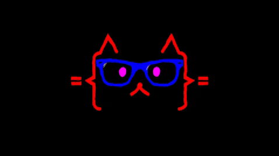

# Look [there](https://xazz.top) ! Nice to see you. </img>

<h3> 👻 ikirito | 📠Student | 🮠Like Games  </h3>
<h4 align="center">
   <i>⚡️ The shortest way to do many things is to only one thing at a time. ⚡️</i>
</h4>

> 看这里！很高兴遇见你，这里是我的个人主页，欢迎来访！

 

- 🌱 我是一名在校大学生，正在努力成为一个大佬。

- ⚡ 喜欢前端，学习前端，所以做前端，当然也玩后端。

- 💬 需要一份实习工作，寻求机会中（xdm别卷了！

<!-- - 📝 我的简历 [Resume](https://xazz.top/resume/) -->

> 👋 点击下面查看详情内容 ~ 👇

 
  
<h2> In the midst of endeavor（努力进行时）.</h2>

  <!-- Some badges are from https://github.com/Ileriayo/markdown-badges -->
  <!-- For more icons please follow https://github.com/MikeCodesDotNET/ColoredBadges -->
    <h3>👨🏻‍💻 Study And Play Now</h3>

 
  
<h2> Github Stats Card（信息卡片）.</h2>

  <h3>🔥 Streak Stats</h3>

  <!-- GitHub Readme Streak Stats - https://github.com/DenverCoder1/github-readme-streak-stats -->
  

    
  

  <h3>🤖 GitHub Profile Stats</h3>

  <!-- https://github.com/anuraghazra/github-readme-stats -->

  

  <h3>🎯 Personal Usually Languages</h3>

  
   

### 项目卡片

### 爱发电支持我 *！*
[微信支付](img/wechat.png) | [支付宝](img/alipay.png) | [PayPal](https://www.paypal.com/paypalme/ikirito9)